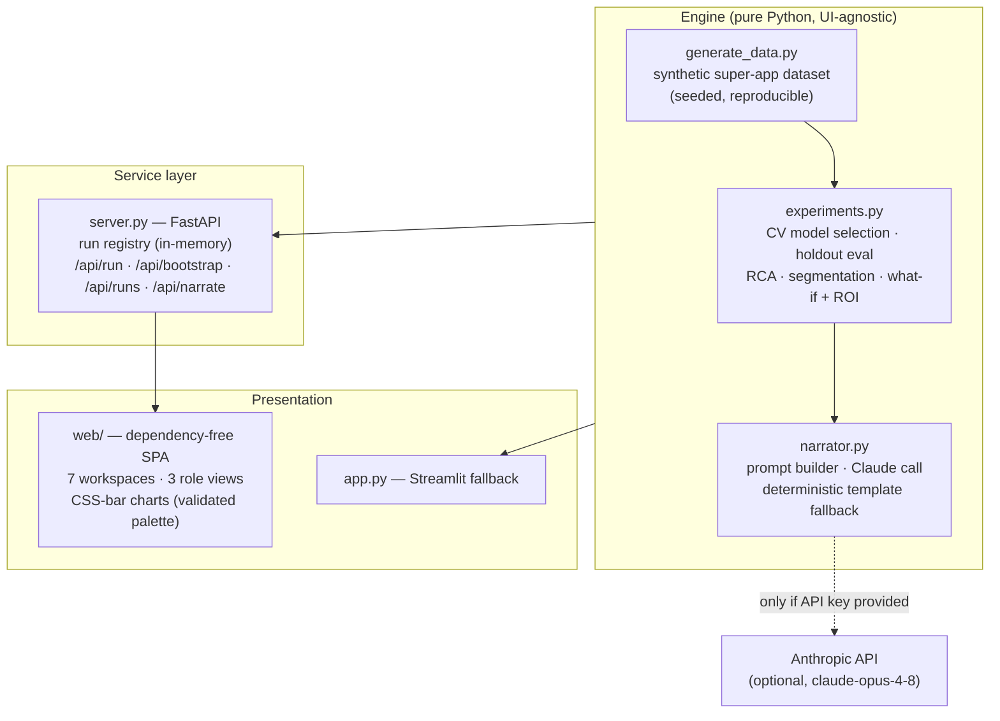
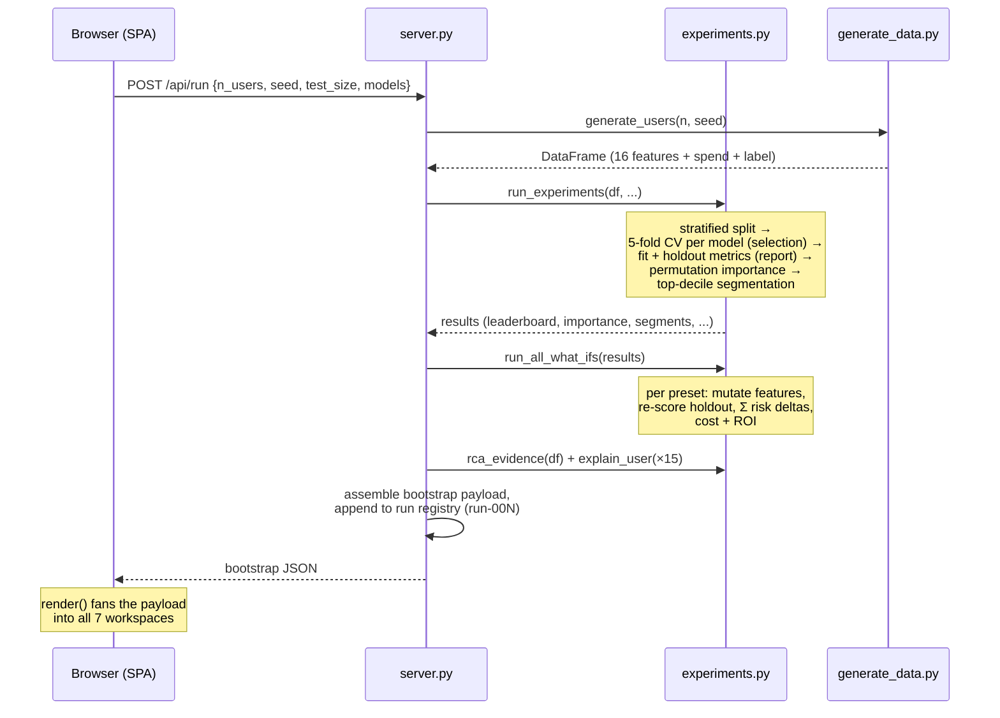

# Churn Lab — Architecture

Detailed technical architecture of the Autonomous Churn Experimenter.
Live: https://churn-lab.onrender.com · Repo: https://github.com/FairosMirza/churn-lab

---

## 1. System overview

Churn Lab is **one Python engine with two shells**: a FastAPI-served product tool
(`server.py` + `web/`) and a Streamlit fallback (`app.py`). Every number shown in
either shell is produced by the same four engine modules, so the analysis cannot
drift between surfaces.



**Design principles**

1. **Engine/shell separation** — `experiments.py` has no knowledge of FastAPI or
   Streamlit; it consumes a DataFrame and returns plain dicts/DataFrames.
2. **Compute once, explore freely** — a run executes the full pipeline once;
   every workspace (root causes, playbook, what-if, leadership, narrator) reads
   from that single precomputed payload, so exploration is instant.
3. **Honesty as a feature** — observational lifts vs model attribution are shown
   side by side, counterfactuals are labelled as planning signals, costs are
   labelled as assumptions, and ROI-negative plays are flagged, not hidden.
4. **Zero build step** — the frontend is hand-written HTML/CSS/JS with no
   framework or bundler; the whole product deploys as `pip install` + `uvicorn`.

---

## 2. Module reference

| Module | Responsibility | Key exports |
|---|---|---|
| `generate_data.py` | Simulate a Careem-like Everything App population. 16 model features + revenue proxy + churn label drawn from a latent logit encoding publicly-documented pain points (RESEARCH.md). | `generate_users(n_users, seed)`, `FEATURES`, `TARGET`, `PAIN_POINT_MAP` |
| `experiments.py` | The autonomous loop: split → CV selection → holdout report → global/local/observational explanation → segmentation → counterfactual intervention simulation with cost/ROI. | `run_experiments(df, seed, test_size, models)`, `rca_evidence(df)`, `explain_user(results, idx)`, `what_if(results, preset)`, `run_all_what_ifs(results)`, `metrics_payload(...)`, `MODELS`, `ACTIONS`, `WHAT_IF_PRESETS`, `INTERVENTION_COSTS`, `EXPERIMENT_DESIGNS`, `RCA_SEGMENTS` |
| `narrator.py` | Turn the metrics JSON into a leadership brief. Structured prompt (visible in-app), live Claude call, deterministic template fallback, and a pre-generated example brief pinned to the default run. | `build_prompt(metrics)`, `narrate_with_claude(metrics, key)`, `narrate_with_template(metrics)`, `SAMPLE_LLM_BRIEF`, `NARRATOR_MODEL` |
| `server.py` | HTTP surface + run registry. Executes runs, keeps the last 20 in memory, serves the SPA. | `app` (FastAPI), `execute_run(...)` |
| `web/index.html` | App shell: sidebar, role switcher, topbar, 7 workspace views. | — |
| `web/app.js` | View router, role gating, run form + history, all renderers (tables, CSS bars, diverging bars, stat tiles), markdown-subset renderer for briefs. | — |
| `web/style.css` | Design system: navy/green product chrome, card/table/chart primitives. Chart palette validated for CVD & contrast (green `#0a9b62`, blue `#2a78d6`, red `#e34948`). | — |
| `app.py` | Streamlit rendering of the same engine (backup deployment path). | — |

---

## 3. The run lifecycle



A run executes **synchronously** (seconds locally, ~1–3 min on the free-tier
CPU); the UI shows a busy state and reports elapsed time. Startup performs one
default run (`run-001`: 8,000 users, seed 42, all models) so the product is never
empty.

### Run registry

- In-memory dict `RUNS[run_id] -> {bootstrap, metrics}` plus ordered `RUN_ORDER`,
  capped at `MAX_KEPT_RUNS = 20` (FIFO eviction).
- Every workspace is driven by the currently loaded run; clicking a row in
  *Run history* loads any registered run into all workspaces.
- Deliberately **not persisted**: restart = clean slate + fresh default run.
  (Production path: swap the dict for a `runs` table + object storage — the
  payload is already JSON-serializable.)

---

## 4. The engine, step by step

### 4.1 Data simulation (`generate_data.py`)

- **Population**: zero-inflated Gamma usage per vertical (rides, food, Quik,
  Pay); `verticals_active` derived; subscription propensity increases with
  breadth and volume of usage.
- **Experience pain points** (each traceable to public sources — see
  RESEARCH.md): `captain_cancellations_90d`, `avg_wait_time_min`,
  `surge_exposure_share`, `refund_delays_90d`, `delivery_delays_90d`,
  `failed_payments_90d`, `support_tickets_90d`.
- **Label**: churn = no activity in the next 60 days, sampled from a latent
  logit. Protective terms: verticals, subscription, tenure, activity.
  Aggravating terms: inactivity, promo dependency, and every pain point.
  Calibrated to ~14.6% base churn at seed 42.
- **Revenue proxy**: `monthly_spend_aed` (business column, deliberately **not**
  a model feature to keep the risk model behavioural).
- Deterministic via `numpy.random.default_rng(seed)`.

### 4.2 Model selection & evaluation (`run_experiments`)

| Stage | Detail |
|---|---|
| Split | `train_test_split(stratify=y)`, configurable holdout (default 25%). |
| Candidates | Logistic Regression (scaled pipeline), Random Forest (200 trees), HistGradientBoosting — any subset selectable per run. |
| **Selection** | **Highest mean 5-fold stratified CV AUC, training data only.** |
| **Report** | The untouched holdout yields the final unbiased metrics: AUC, PR-AUC, Brier, recall@top-10%. |

*Why:* selecting on holdout AUC silently turns the test set into a validation
set and biases the reported number ("test-set peeking") — Raschka (2018),
[arXiv:1811.12808](https://arxiv.org/abs/1811.12808). *Trade-offs:* the CV mean
averages fold-models (not the final refit) and carries variance — within 0.01
AUC prefer the simpler model; with hyperparameter tuning, upgrade to nested CV.

*Metric choice:* `recall@top-10%` is the operational metric — a retention team
can only ever contact a slice; PR-AUC is judged against the base churn rate;
Brier tracks calibration.

### 4.3 Three-level explanation ("why")

| Level | Method | Question answered |
|---|---|---|
| Global | Permutation importance on the holdout (`n_repeats=5`, AUC drop) | What does the model rely on? |
| Observational | `rca_evidence`: for each pain-point exposure, churn(exposed) vs churn(not), lift = ratio | Why do the raw numbers look this way? |
| Local | `explain_user`: reset one feature at a time to the holdout median, measure risk delta | Why is *this* user at risk? |

The observational table deliberately surfaces **confounding** (surge exposure
shows lift < 1 because it correlates with heavy riding, which protects) and is
displayed next to model attribution rather than instead of it. Local attribution
is one-feature-at-a-time (fast, intuitive; no interactions — SHAP is the
production upgrade).

### 4.4 Segmentation → playbook

Top-decile-risk holdout users are assigned a **retention segment** by an ordered
rule cascade over pain-point features (`_dominant_driver`), each mapped to a
concrete action with an assumed save rate. Segment value =
`Σ monthly_spend × save_rate × 12`. The segment is an *action-routing* label and
may differ from the model's top risk factor — the UI states this explicitly and
shows both.

### 4.5 Counterfactual what-if engine

For each intervention preset (e.g. *Halve Captain cancellations*):

```
X' = preset(X_holdout)                    # mutate the feature matrix
Δp_i = max(p(x_i) − p(x'_i), 0)           # per-user risk reduction
churners_prevented = Σ Δp_i
revenue_protected  = Σ Δp_i · spend_i · 12
cost               = users_affected · unit_cost[preset]     (assumption)
ROI                = (revenue_protected − cost) / cost
```

ROI-negative plays are flagged (at default assumptions, *Halve surge exposure*
protects AED 24K but costs AED 41K). Each preset ships with an A/B design
(hypothesis, primary metric, guardrails) in `EXPERIMENT_DESIGNS` — the estimates
rank bets; the pilots confirm them.

### 4.6 Narration

`metrics_payload()` compacts the run (leaderboard, drivers, RCA lifts, segments,
what-ifs with ROI, revenue at risk) into JSON. The prompt (visible in-app)
demands a fixed six-section brief, forbids invented numbers, requires plain
business language, and instructs the model to flag confounders and
negative-ROI plays. Delivery: Claude (`claude-opus-4-8`) when a key is present;
otherwise a deterministic template with the same structure. A pre-generated
Claude brief for the default run is embedded (`SAMPLE_LLM_BRIEF`) and labelled
**Example — run-001**, with a mismatch banner when another run is loaded.

---

## 5. Service layer (`server.py`)

| Endpoint | Method | Contract |
|---|---|---|
| `/api/run` | POST | `{n_users: 2000–20000, seed, test_size: 0.15–0.4, models: [...]}` → executes the loop, registers the run, returns its bootstrap payload. |
| `/api/bootstrap` | GET | `?run_id=` optional (default: latest). Full payload for one run. |
| `/api/runs` | GET | Registry summaries, newest first (id, time, params, best model, AUC, revenue at risk). |
| `/api/narrate` | POST | `{api_key?, run_id?}` → `{source, brief}`. Key is used for one call and never stored; falls back to the template on any failure. |
| `/` | GET | Static SPA (`web/`, `html=True`). |

### Bootstrap payload (the single data contract)

```
run{id, created_at, params}            meta{n_users, seed, churn_rate, ...}
leaderboard[ {model, cv_auc_mean, cv_auc_std, cv_pr_auc_mean, test_auc,
              test_pr_auc, recall_at_top10pct, brier_score, train_seconds} ]
best_model                             churn_by_verticals{0..4: rate}
importance[ {feature, importance} ]    rca[ {segment, share_of_users,
                                             churn_if_exposed, churn_if_not, churn_lift} ]
segments[ {driver, users, avg_risk, recommended_action,
           assumed_save_rate, est_users_saved, annual_revenue_protected_aed} ]
what_ifs[ {intervention, users_affected, baseline/new_churn_rate,
           churners_prevented, annual_revenue_protected_aed,
           est_annual_cost_aed, roi, design{hypothesis, primary_metric, guardrail}} ]
explanations[ {user, risk, driver, contributions[ {feature, user_value,
               typical_value, risk_contribution} ]} ]     # top 15 at-risk users
leadership{customers_at_risk, annual_revenue_at_risk_aed, top_driver,
           best_play, best_play_revenue, top2_combined_revenue}
narrative{template_brief, sample_llm_brief, prompt, model}
pain_points{feature: public theme}     available_models[]   summary{...}
```

---

## 6. Frontend (`web/`)

- **App shell**: fixed sidebar (brand, role switcher, nav, current-run chip) +
  workspace pane with topbar (view title, status chip).
- **View router**: seven `<div class="view">` panels toggled by nav clicks; no
  URL routing needed (single-session tool).
- **Role gating** (`ROLES` in `app.js`): Data Scientist sees everything;
  Product sees Root causes / Playbook / What-if / Narrator / Methodology;
  Executive sees Leadership / Narrator. Each role has a landing view. Gating is
  presentational (a lens, not security).
- **Rendering**: one `render(bootstrap)` fans the payload into every workspace;
  tiny helpers build tables, horizontal CSS-bar charts, diverging bars
  (risk up = red right of a midline, down = blue left), and stat tiles.
  A ~30-line markdown-subset renderer displays briefs (bold, bullets, numbered).
- **Charts**: pure CSS bars — no chart library. Palette passed a 6-check
  validation (lightness band, chroma, colorblind separation, contrast); every
  bar carries a direct value label.
- **Runner UX**: form → POST `/api/run` → busy status → results loaded into all
  workspaces + history refreshed; failures surface inline.

---

## 7. Deployment

| Target | Mechanism |
|---|---|
| Local | `pip install -r requirements.txt` → `uvicorn server:app --port 8601` |
| **Render (live)** | `render.yaml` blueprint, native Python runtime (no Docker): build `pip install -r requirements.txt`, start `uvicorn server:app --host 0.0.0.0 --port $PORT`, health check `/api/runs`. Auto-deploys from `main`. |
| Docker / HF Spaces | `Dockerfile` (python:3.11-slim, port 7860/`$PORT`). |
| Streamlit Cloud | `app.py` fallback shell. |

Config via env vars: `CHURN_LAB_USERS`, `CHURN_LAB_SEED` (startup run),
`ANTHROPIC_API_KEY` (optional server-side narrator key).

**Free-tier characteristics**: instance sleeps when idle (~30–60 s cold start,
which includes re-running the startup experiment); UI-triggered runs take
minutes on the shared CPU vs seconds locally.

---

## 8. Trust & privacy

- **No real data anywhere**: the dataset is synthetic, self-created, and
  regenerated from a seed; `superapp_churn.csv` in the repo is the seed-42
  export for convenience.
- **API keys**: pasted keys travel one request, are used for a single Claude
  call, and are never logged or persisted.
- **No accounts / no user data**: the tool stores nothing but in-memory run
  results, which vanish on restart.

---

## 9. Known limitations & the production path

| Prototype choice | Production upgrade |
|---|---|
| Simulated churn label | Observed label (e.g. 60-day inactivity) with a locked feature cutoff to prevent leakage |
| No hyperparameter search | Search inside **nested CV** (inner select, outer estimate) |
| One-at-a-time local attribution | SHAP values |
| Assumed save rates & intervention costs | Measured treatment effects from the A/B designs shipped with each play |
| In-memory run registry | Persistent run store (DB + object storage), authn, per-team workspaces |
| Raw probabilities | Isotonic calibration; drift monitoring per market; scheduled retrains |
| Synchronous runs | Job queue + progress events for large datasets |
| Counterfactual = causal assumption per mutated feature | Uplift modelling / experimentation platform integration |

Every limitation above is also stated inside the product (Methodology
workspace), because a decision tool that hides its assumptions isn't one.
